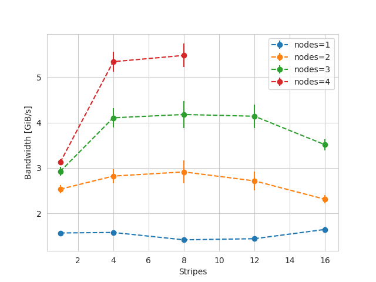

# Cirrus e1000 testing 

Testing was started in late February 2024 until early March 2024, while cse was given access to install new software.

## Output to shared file 

We tested parallel writing to a single shared filed aligned in blocks of 2MiB , groups of 16MiB per segment and 100 segments.
For up to 4 nodes, we see a modest increase in performance as increasing the number of stripes, possibly due to the fact the number of nodes is to small to effectively benefit from striping. Maximum observed write bandwith was about 5.5 GiB/s.

.
*Bandwith in function of the number of stripes with 36 tasks per node and different number of nodes. Performance increase with number of stripes is limited to higher node counts.*
