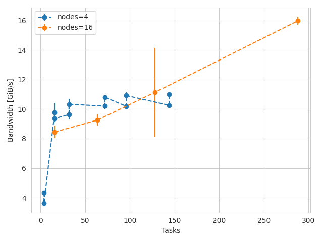

# Cirrus e1000 testing 

Testing was started in late February 2024 until early March 2024, while cse was given access to install new software.

## Output to shared file 

We tested parallel writing to a single shared filed aligned in blocks of 2MiB , groups of 16MiB per segment and 100 segments.
For up to 4 nodes, we see a modest increase in performance as increasing the number of stripes, possibly due to the fact the number of nodes is to small to effectively benefit from striping. Maximum observed write bandwith was about 5.5 GiB/s.

.

*Bandwith in function of the number of stripes with 36 tasks per node and different number of nodes. Performance increase with number of stripes is limited to higher node counts.*

.

## File per process

We tested file per process bandwith, memory aligned, transfers of 2MiB in 100 segments of size 16GiB . 

.

*Bandwith in function of the number of tasks for 1 node and 4 nodes. A single node tops at ~6GiB/s while 4 nodes bandwith tops at ~11GiB/s*.

## Metadata -- easy

Me made a simple metadata test creating empty files, each rank creating files in a different folder.

.

* Rate of metadata operations in function of the total number of files operated on. Both creation and removal tops at ~35KOP/s, while `stat` operation reach over 80 KOP/s  *

## Metadata -- hard

.

* Rate in function of the number of files in thousand of operations per second. With 4 nodes creation rate tops at 9 KOPS/s for file creation and 6 for data removal. This is likely due to directory locking. The performance of stat operations peaks at about 80 KOP/s.*

## IO500 

Results from io500 runs on a striped directory with 16 CPU nodes are summarized in a [csv file](io500/16N/io500_agg.txt)

## Flash 

We also tested the flash rpool using file per process benchmarks. We found a maximum bandwith of about 16GiB/s. With 4 nodes we observed performance to saturate at about 10 GiB/s vs 6GiB/s on the default rpool ( spinning disk). Maximum performance from the whole filesystem I have seen is 16 GiB/s. For comparison, the maximum performance on the spinning disk was about 12 GiB/s, but with fewer nodes ( hence the teo measurements are not directly comparable ).
Raw data is in `cirrus-e1000/flash/reports` and summary data is in `cirrus-e1000/flash/fpp-write.dat` . 

* Results of file per process tests for different number of nodes and tasks per node on the solid state partition.*
